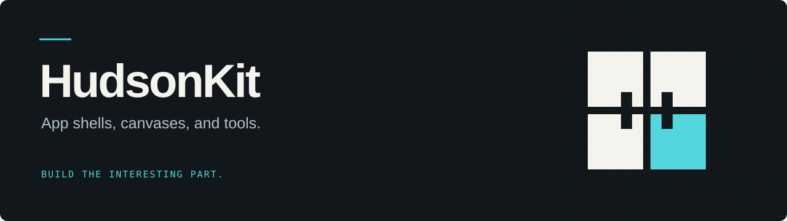
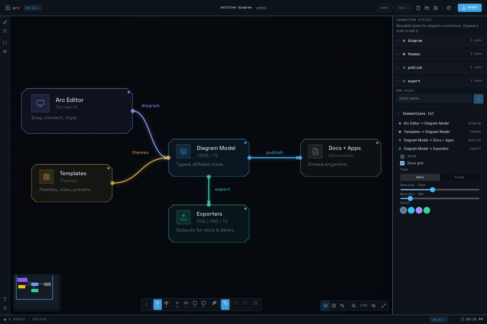

[](https://hudsonkit.com)

[](https://www.npmjs.com/package/hudsonkit)
[](https://www.npmjs.com/package/@hudsonkit/ai)
[](./LICENSE.md)

**Build your app. HudsonKit supplies the workspace around it.**

Navigation, side panels, command palettes, status bars, draggable windows, and an infinite canvas. Compose them into a single-app shell or a workspace where several apps share the same chrome. Your app owns its state and content; the shell handles the surrounding interface.

[Explore HudsonKit](https://hudsonkit.com) · [Try the workspace](https://hudsonkit.com/demo/) · [Quickstart](./docs/quickstart.md) · [API reference](./docs/api.md)

## Built with HudsonKit

[](https://hudsonkit.com/arc/)

**[ARC](https://hudsonkit.com/arc/)** is a diagram editor built on HudsonKit’s `AppShell`. ARC supplies the diagram model, drawing tools, and inspector content; Hudson supplies the shell that holds them together. The screenshot shows the running editor with its built-in example diagram.

[Try ARC →](https://hudsonkit.com/arc/) · [Read the source →](https://github.com/arach/arc)

## Start building

```sh
bun add hudsonkit
```

Import the prebuilt styles once in your app entry point:

```tsx
import 'hudsonkit/styles';
```

A plain React component can become a Hudson app:

```tsx
'use client';

import { AppShell, createEmbedApp } from 'hudsonkit/app-shell';

const { app } = createEmbedApp({
  id: 'hello',
  title: 'My first app',
  component: () => <div style={{ padding: 24 }}>Hello, Hudson.</div>,
});

export default function Page() {
  return <AppShell app={app} />;
}
```

For an app with its own state, panels, and commands, implement `HudsonApp`: a **Provider** owns state, **slots** supply content, and **hooks** connect commands, search, and status to the shell. Follow the [quickstart](./docs/quickstart.md) or the [building apps guide](./docs/building-apps.md).

The web SDK targets React 19. Install a published package or a sealed tarball when consuming it outside this repository. See the [consumer setup rules](./AGENTS.md#consuming-hudsonkit-externally) for Next.js and Tailwind configuration.

## Choose your surface

| Surface | Use it for |
| --- | --- |
| **`AppShell`** | One app with navigation, panels, commands, and status. |
| **`WorkspaceShell`** | Multiple apps in a shared canvas or panel workspace. |
| **Canvas and windows** | Pan, zoom, drag, resize, and persist window positions. |
| **Optional AI backends** | Provider-neutral AI integration through [`@hudsonkit/ai`](./docs/ai.md). |
| **Apple-native SDKs** | Swift packages for [macOS shells](./docs/macos-shell.md), [iOS shells](./docs/ios-shell.md), and [Hudson Canvas](./docs/hudson-canvas.md). |

This repository includes the SDKs, the web workspace, developer tools, and **Canvas**, a native macOS app for terminals and workspace artifacts.

## Work on Hudson

```sh
git clone https://github.com/arach/hudson.git
cd hudson
bun install
bun dev
```

Open [localhost:3500](http://localhost:3500) for the web workspace. For the native Canvas app, see [Hudson Canvas](./docs/hudson-canvas.md).

| Path | Contents |
| --- | --- |
| `packages/web/hudsonkit/` | Web SDK, shell, and UI primitives |
| `packages/web/ai-backends/` | Optional AI backends |
| `packages/web/admin/` | Schema-driven admin surfaces |
| `packages/native/apple/HudsonKit/` | Apple-native Swift package |
| `packages/tools/` | Scaffolding and diagnostics tools |
| `apps/web/` | Web workspace, example apps, and website |
| `apps/canvas/` | Native macOS Canvas app |
| `docs/` | Guides and reference material |

## Documentation

- [Overview](./docs/overview.md) and [architecture](./docs/architecture.md)
- [Building apps](./docs/building-apps.md) and [API reference](./docs/api.md)
- [Drag, resize, and pan performance](./docs/perf-drag-resize-patterns.md)
- [Agent reference](./docs/agent/overview.agent.md)
- [Contributing](./CONTRIBUTING.md)

HudsonKit is still **0.x**. Review the [web SDK changelog](./packages/web/hudsonkit/CHANGELOG.md) when upgrading; APIs may change between releases.

## License

The source in this repository is licensed under [Apache 2.0](./LICENSE.md). See [NOTICE](./NOTICE.md) for third-party notices and separately licensed assets. Previously published package versions retain the license included with those releases.
