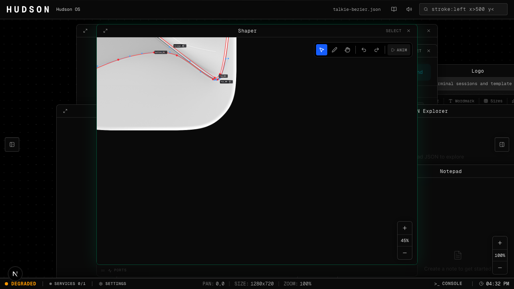
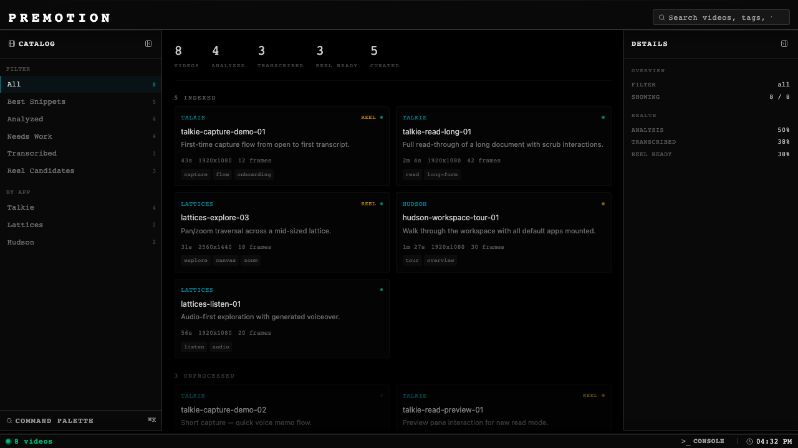

# Hudson

[](https://www.npmjs.com/package/hudsonkit)
[](https://www.npmjs.com/package/@hudsonkit/ai)
[](https://github.com/arach/hudson/actions/workflows/ci.yml)
[](./LICENSE.md)



An opinionated app shell for browser-based multi-app workspaces. Chrome once, apps plug in.

## What this is

Hudson is a **shell**, not a framework. It owns the workspace chrome — nav bar, side panels, command palette, terminal, status bar, canvas pan/zoom — and hosts **apps** that plug in via a small `HudsonApp` interface: a Provider for state, slot components for the shell to render, and hooks the shell reads for labels, search, status.

Two modes:

- **`AppShell`** — the default. One app, full chrome. Best for single-purpose products.
- **`WorkspaceShell`** — multi-app canvas. Apps float as windows on a shared dotted-grid workspace. The screenshot above: Shaper (vector editing), Logo Designer, and Notepad all sharing one set of chrome.

## Install

```sh
bun add hudsonkit      # or: npm install hudsonkit
```

`hudsonkit` is the shell + primitives. `@hudsonkit/ai` is an optional, provider-neutral AI backend (pi-ai and Vercel AI adapters) — add it only when your app needs the AI panel or agent surface:

```sh
bun add @hudsonkit/ai
```

Peers: React 19 (`react`/`react-dom`) and `lucide-react`. Terminal and editor extras (CodeMirror, xterm) are optional peers, pulled in only if you use those surfaces.

New here? The [quickstart](./docs/quickstart.md) mounts `AppShell` with a minimal app in a few minutes; [building apps](./docs/building-apps.md) covers the full `HudsonApp` contract.

## Why

I build a lot of small apps. Each one was ~70% chrome: sidebar, settings, command palette, status bar, keyboard shortcuts, persistent-state plumbing, AI panel. Hudson is that chrome extracted as a primitive, so every new project starts from *build the interesting part* instead of *build yet another sidebar*.

## Case study: Premotion

[](./docs/case-study-premotion.md)

**[Full write-up →](./docs/case-study-premotion.md)**

A video catalog browser built on Hudson SDK. Fresh Next.js 16 + React 19 project, imports `hudsonkit/app-shell`, fills in a single `HudsonApp` with Provider + slots, ships. Left panel + search + status bar + inspector + URL-driven filter state all came from the shell — the only real work was the catalog logic itself.

The case study walks through the build *and* the real friction points we hit consuming the SDK from outside its monorepo (Tailwind scanning, symlink shape, barrel exports, `'use client'` directives) — and what got fixed vs. what's still on the follow-up list.

## Native Canvas

Hudson ships **Canvas** — a native macOS spatial canvas for tmux sessions,
terminals, and workspace artifacts. The surface is embeddable via `HudsonCanvas`;
Scout, Talkie, Fabric, or your own app can host one too.

```sh
apps/canvas/scripts/run-app.sh
```

See [Hudson Canvas](./docs/hudson-canvas.md) for the SDK boundary.

## Orientation

```
app/                               # The Hudson workspace itself (Next.js 16)
apps/canvas/                       # Native Canvas macOS product (CanvasApp host)
packages/web/hudsonkit/            # Shell + primitives — published as `hudsonkit`
packages/web/ai-backends/          # Provider-neutral AI backends — published as `@hudsonkit/ai`
packages/tools/create-hudson-app/  # `create-hudson-app` scaffolder
packages/tools/hkit/               # `@hudsonkit/hkit` design & diagnostics CLI
packages/native/apple/HudsonKit/   # Apple-native Swift package
packages/services/hudson-relay/    # Terminal relay service
docs/                              # Architecture, case study, builder notes
examples/                          # SDK reference apps (hudsonkit-reference, …)
```

Dev:

```bash
bun install
bun dev           # Hudson workspace on :3500
```

## State

Hudson is **built in the open** and now **published to npm** — both `hudsonkit` and the optional `@hudsonkit/ai` ship real releases. Versioning is automated with [changesets](https://github.com/changesets/changesets): a "Version Packages" PR keeps bumps and changelogs current, and merging it publishes from CI. This monorepo stays the source of truth — the packages are built and versioned from here.

It's still **0.x**, so the surface moves: the code is legible and the commits are explicit, but APIs can change between releases — pin a version and skim the changelog before bumping. The [Premotion case study](./docs/case-study-premotion.md) documents the real friction of consuming the SDK from outside its monorepo (Tailwind scanning, symlink shape, barrel exports, `'use client'`) — some of it since fixed, some still on the follow-up list.

If you're looking at this to understand *how I think about building apps*, start with the [overview](./docs/overview.md) and the [case study](./docs/case-study-premotion.md).

## Stack

React 19 · Next.js 16 · Tailwind v4 · bun · TypeScript

## Docs

- [Overview](./docs/overview.md) — what Hudson is, the mental model
- [Architecture](./docs/architecture.md) — how the shell is structured
- [Case study: Premotion](./docs/case-study-premotion.md) — the real consumption story
- [Building apps](./docs/building-apps.md) — the `HudsonApp` contract in detail
- [Perf patterns](./docs/perf-drag-resize-patterns.md) — drag/resize/pan tricks worth reusing
- [For agents](./docs/agent/overview.agent.md) — LLM-oriented reference
