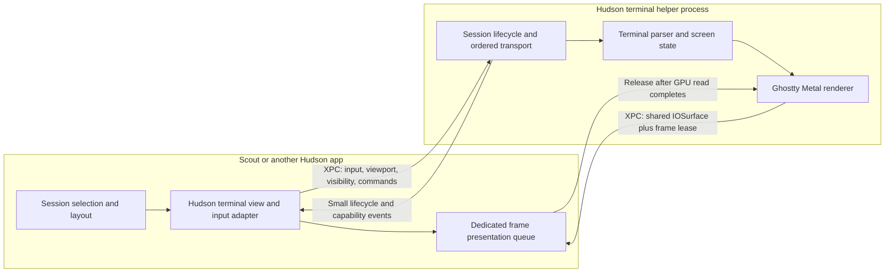

# Native terminal core and process isolation

Status: architecture direction accepted by the operator, 2026-09-16; bounded
XPC/IOSurface/Metal probe implemented and checked locally. Production migration is not implemented.
Owner: Hudson native terminal lane. First consumer: Scout. Review before stable API promotion.

Operator constraints: performance first; AppKit/Metal, no SwiftUI in the terminal
implementation. Rust is permitted for worker transport, queues and lifecycle.
The existing Ghostty Zig/C parser/renderer remains the initial engine. The first
platform probe uses Swift because its scope is NSXPC, AppKit and Metal; it does
not lock the session core to Swift. Choose Rust for a substantive portable core,
not an extra FFI hop around native APIs with no measured benefit.

## Decision

Hudson owns the reusable native terminal implementation and its process boundary.
Scout consumes a terminal session/surface API and owns product policy: which
sessions to open, workspace identity, layout, agent routing and operator attention.

The helper owns the PTY/SSH transport, ordered terminal bytes, parser and screen
state, scrollback, renderer and frame scheduling. The AppKit host owns input capture,
accessibility integration and a thin frame presenter. Moving only PTY reads to
a helper would leave parsing and rendering on Scout's hot path and would not
fulfill this decision.

Termini/libghostty remains an internal rendering dependency initially. Hudson
ownership does not require rewriting the terminal engine. App consumers should
stop importing Termini types after the migration.

## Package responsibilities

Names below describe the target decomposition, not stable products already shipped.

| Boundary | Owns | Must not own |
| --- | --- | --- |
| `HudsonTerminalCore` | Session identity/state machine, protocol values, limits, sequence/epoch rules, frame leases, transport/parser adapters | Scout models, tile layout, app navigation |
| Hudson terminal helper | PTY/SSH lifecycle, terminal state, libghostty/Metal, bounded per-session scheduling, frame buffers | Scout main-thread work or direct clipboard/UI actions |
| `HudsonTerminal` view/client | IPC supervision, keyboard/IME/pointer adapter, local accessibility snapshot, surface presentation | PTY byte parsing, scrollback storage, periodic polling of every session |
| Scout adapter | Launch intent, approved environment/cwd, session names, attention, layout and host policies | Renderer loops, Termini workspaces/controllers, process protocol internals |

The existing native API exposes `TerminiTerminalController`, and Scout creates
`TerminiLocalPTYWorkspace` itself. Migrate those dependencies behind Hudson's
session handle rather than making Scout orchestrate another helper directly.
Keep the browser xterm path and iOS in-process path separate from this macOS
process architecture. Neither platform is switched by this document.

## IPC and frame ownership

**Control plane:** an app-bundled XPC service, asynchronous calls and typed,
versioned values. Negotiate protocol and capabilities before opening sessions.
Each message carries a connection/session generation; input, resize and frame
streams carry monotonic sequence numbers. Never synchronously wait for the
helper on the production app's main thread. The probe uses bounded synchronous
waits only as test orchestration.

**Frame plane:** share IOSurface objects; send small descriptors, not encoded
screenshots or text/cell grids at every frame. Apple's IOSurface API explicitly
supports cross-process sharing, and the macOS 26.5 SDK declares `IOSurface`
conformant to `NSSecureCoding`, allowing the object on an NSXPC interface.

The inspected Ghostty source already has IOSurface-backed Metal render targets.
Its current embedding API does not provide a supported remote-frame lease
contract. That is an implementation gate, not something a Swift wrapper can
assume away.

Required producer/consumer rules:

1. Start with a fixed three-buffer pool per surface and an explicit total
   pixel-memory budget. Validate size, pixel format, stride, scale and allocation
   length before using a received surface.
2. Publish only after the producer GPU command buffer completes successfully.
   A shared pointer is not a GPU completion fence.
3. Keep a published buffer immutable until its exact lease is released. Include
   worker generation, surface generation and frame sequence in the real token.
4. Prefer a small Metal presenter that reads the shared texture into the app's
   drawable, then acknowledges after that GPU read completes. This avoids CPU
   pixel copies but may require a GPU copy/draw. Assigning `CALayer.contents`
   and acknowledging immediately is not a safe buffer-reuse contract.
5. Reject duplicate, unknown and old-generation acknowledgements. A late ACK
   must never free a buffer already recycled for a newer frame.
6. With no free frame credit, continue parsing terminal output and retain one
   dirty/latest-state marker; skip obsolete presentation work. **Never drop or
   reorder terminal bytes.** Resume rendering from the current screen state
   when credit returns.
7. Resize retires the old pool only when its leases/GPU work are finished.
   Coalesce further resizes while retirement is pending; do not allocate one
   unbounded pool per resize event.
8. Hide/reveal controls rendering, not session liveness. Hidden sessions keep
   correct state under bounded transport flow control and render current state
   once when revealed.

**Do not use KVO of Ghostty's private layer tree as the production frame API.**
Its renderer may recycle a target after local completion without knowing about
an external reader. Add an explicit supported export/release hook at the engine
boundary, or an explicitly synchronized copy into a Hudson-owned bounded export
pool. Compare the additional GPU work before selecting either path.

## Isolation topology and limits

Initial topology: one private terminal helper per application instance, with
bounded/fair scheduling per pane. XPC service connections are not a promise of
one new process per pane. Add a bounded worker pool only if noisy-pane or crash
isolation measurements justify its memory and supervision costs.

The helper owns a separate main loop for engine/platform requirements. Its
render target must support offscreen/remote presentation explicitly; a hidden
window forced visible to trick occlusion is not a production design.

The terminal exposes an AppKit `NSView` and uses a dedicated Metal presentation
queue. It contains no SwiftUI view, `NSHostingView`, Observation view graph or
SwiftUI-driven frame updates. A SwiftUI application may wrap this view at its
outer integration boundary only. AppKit view creation, geometry and input still have
main-thread requirements. **Process isolation alone does not guarantee visible
updates or keyboard responsiveness while the app main thread is blocked.**
The embedded probe now verifies GPU submission/completion and drawable pixel
integrity during a main-thread stall. It does not measure visible scanout, and
AppKit keyboard/IME events still require the main thread.

No terminal byte stream should traverse the app process for normal rendering.
Metadata events update only the affected session. Metrics are aggregate counts,
queue ages and timings, not transcript logging.

## Lifecycle and integration contracts

- Opening, running, stopping, stopped and failed are explicit states. Keep a
  process/session owner until exit acknowledgement, with a bounded escalation
  policy. Late callbacks from old generations cannot change a replacement.
- Do not automatically rerun a shell command after a helper crash. Mark the
  surface failed; reconnect to an existing durable tmux session when policy
  allows it, otherwise require an explicit new session. XPC may relaunch a
  service process; that must not imply replaying `openSession`.
- A private app-bundled helper is not a durable terminal daemon. App exit and
  worker failure semantics must be explicit. Durable session continuity belongs
  to the selected multiplexer/backend or a separately designed service.
- Bound startup, requests, pending input/paste and queued control messages.
  Preserve input order; apply backpressure before limits are exceeded. Keep
  keyboard commands responsive under output saturation and preserve pane fairness.
- Resolve clipboard, file/link opening and attention through host callbacks and
  existing product policy. Terminal escape sequences do not grant new privileges.
- IME marked text, candidate position, selection, copy, mouse reporting,
  bracketed paste, hyperlinks and accessibility are migration gates, not polish.
  Keep bounded local snapshots for synchronous AppKit/accessibility queries;
  remote queries must not block the UI thread.
- Production packaging needs a signed embedded helper, explicit peer identity
  checks, compatible entitlements and invalidation handling. The ad-hoc probe
  tests neither deployment signing nor a security boundary.

## Delivery sequence and acceptance gates

### 1. Establish the boundary in Hudson

This document plus the isolated `Tools/TerminalIsolationProbe` exercise real
NSXPC, IOSurface transport, producer/consumer GPU completion, bounded frame leases
and an AppKit-only presenter. No stable Hudson target or
Scout release imports the probe. Follow HUD-009 admission/live-proof rules before
promoting experimental mechanics into a stable API.

Acceptance: different client/worker PIDs, correct shared pixels, three-frame
maximum, no overwrite of held frames, stale ACK rejection, worker progress while
the client main thread is stalled, and owned helper/build cleanup. These checks
pass in the local synthetic probe; they are not terminal-engine acceptance.

### 2. Integrate actual Ghostty frames

Implement the supported frame-export/lease hook and offscreen worker runtime.
Replace the synthetic GPU producer behind the demonstrated AppKit/Metal presenter
and implement a semantic input/IME adapter.
Use the same standalone/minimal/full-host workload from Scout's performance lab.

Acceptance: actual terminal output/input and selection; producer/consumer GPU
fences; resize and backing-scale changes; no app-side parsing or main-thread
synchronous draw; bounded retained frame memory; correct live pixels while the
app is busy. A synthetic texture or heartbeat alone cannot pass this gate.

### 3. Move lifecycle and adopt in a Scout proof target

Expose Hudson session handles and replace Scout's direct Termini workspace usage
in an isolated proof target first. Preserve current session identity and product
routing. Exercise two independent consumers before stable promotion, per HUD-009.

Acceptance: shell/tmux/SSH correctness as supported, immediate and explicit stop,
worker crash/host crash/reconnect without duplicate command execution, hidden
busy panes, approvals/failures still delivered, compatibility and signing checks.

### 4. Decide the production cutover from measurements

Compare installed Scout before/after with matched standalone Ghostty. Measure
input-to-visible latency, parser backlog age, p95 frame intervals, app/worker CPU
and wakeups, total RSS, startup and 1/4/8-pane behavior. Repeat after sustained
output and long-session soak. IPC and an extra presentation pass have real costs;
keep the in-process path available until the isolated path clears those gates.

## Local proof and remaining build gate — 2026-09-16

The windowed probe on this Mac mini passed all lease and pixel-integrity checks.
It completed 17 frames during a 300 ms observation interval entirely inside a
verified 500 ms AppKit main-thread stall (30 frames total, zero presenter errors).
The helper and client had separate PIDs; the three shared 512×256 BGRA buffers
occupied 1.5 MiB. The runner verified helper exit and removed its build bundle.
This is feasibility evidence, not a comparison with Ghostty, xterm or wterm.

The current worker produces synthetic GPU colors, with no terminal parser or
PTY. The source remains under `Tools/TerminalIsolationProbe`, outside the stable
SwiftPM graph. Headless mode verifies the IPC/pool contract; `--window` adds the
AppKit presenter and the within-stall GPU check. `README.md` records exact limits.

The inspected Ghostty renderer completes its local frame immediately after
`Metal.present`; its public C API has no export/release hook that keeps a buffer
leased to another process. Production integration must explicitly extend this
contract and handle offscreen sizing/occlusion. Do not ship the probe as if it
already isolates Scout terminals.

Local engine-build prerequisites are incomplete: the CLT SDK has no offline
`metal` utility, and the full Xcode `metal --version` shim reports a missing Metal
Toolchain component. Full Xcode also reports an unaccepted license. The probe
compiles its small presenter shader through the runtime Metal API, which does
not establish that a modified Ghostty library can be built. Complete Xcode's
operator-controlled setup, install the required Metal component, then use a
pinned Zig toolchain (the inspected source requires 0.15.2) for the engine gate.
No legal terms were accepted and no system toolchain was changed by this work.

## Evidence and sources

- Scout source performance pass: [Termini #16](https://github.com/arach/Termini/pull/16)
  and [Scout #952](https://github.com/arach/openscout/pull/952).
- Existing lifecycle findings: [Scout #946](https://github.com/arach/openscout/issues/946#issuecomment-5700342792).
- [Apple IOSurface](https://developer.apple.com/documentation/iosurface): shared framebuffers/textures across processes.
- [Apple XPC services](https://developer.apple.com/library/archive/documentation/MacOSX/Conceptual/BPSystemStartup/Chapters/CreatingXPCServices.html): asynchronous process boundary and secure-coding contract.
- Inspected local Ghostty source: `src/renderer/metal/Target.zig`,
  `Frame.zig`, `IOSurfaceLayer.zig`, and `src/renderer/Metal.zig`.
  The local source's identity relative to the distributed binary remains unproven;
  source inspection establishes a design lead, not a supported binary export API.
